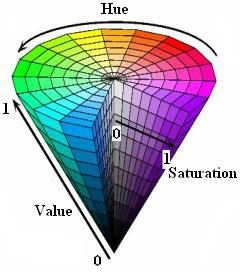

# 色彩三要素

- 色相：基色
- 明度：明暗
- 纯度：饱和

其中明度和纯度感官差异上有些区分不开，可以借助如下定义

- 纯度：颜色中灰色含量的多少
- 亮度：颜色中黑白占比的多少

因为明亮和饱和的颜色都会对眼睛有明显的刺激，反正我是分不太清。

# RGB

> 光学三原色：红绿蓝
>
> 颜料三原色：红黄蓝

虽然我们最常听说的就是`RGB`，但我得强调一点，这只是最物理的表达方式，而非人最容易接受的方式。

在电视或液晶显示上面，通常使用这种办法，由于最物理，开发也最适合。

不过这种混杂生色，除了基色，加上黑白灰，其他颜色并不好掌握，至少对我来说是的。

`RGB`空间中，每个坐标的本身代表一种基色，值的大小代表的是明度。

所以原点是无明的黑，最远点是无暗的白。

可以发现一个关键点：**`RGB`空间是没有纯度的度量的**

同样，对于组合色：**`RGB`空间没有色相的度量**

> 其他的颜色就是空间中的坐标点，三原色依据不同亮度进行的组合，总量共有
> $$
> total = 256 \times 256 \times 256 =1677216 = 2^{24} 
> $$

`RGB`空间当中，比较诟病的是

- 没有准确的色相的表述
- 没有准确的明度的表述
- 色相和明度的混杂组合

对于照片，我只想单独做色相或者纯度，抑或是明度的修改，我得同时对三个通道进行修改。

不可能对单一属性做直接的修改。

正是**易实现，难表达，难修改**

# YUV

看过黑白电视或者素描的都知道，我们就算变成熊猫，就算只有黑白，其实问题也不大。

也就是说，对于色彩表示，明暗的表现力更甚颜色。限于技术，也是需求决定，明暗始终先行。

> `YUV`的出现，也是基于现实因素。
>
> 当时正处于彩色电视发展的阶段，如何去兼容黑白电视和彩色电视成了问题。
>
> 采用`RGB`进行传输的话，实现上确实简单，但是存在两个痛点
>
> - 必须同时传输三组分量，带宽占用消耗大
> - 黑白电视并不直接支持
>
> 如果让人升级网络，还要买彩电，受众就只有土豪了吧。
>
> 但是如果维护两种信号线路，不仅成本增加，对于单一产品，还得两种编码，更繁琐了。
>
> 基于此，需要一种新的技术来做整合
>
> - 能够单独控制明暗
> - 而且能够填充色彩
> - 最好可以分开传输

`YUV`正是这样的技术，它着重于明度的控制，可以后续填充颜色，而且两种信号并非绑定。

降低了带宽消耗，对于黑白电视，只需要`Y`明度变化就可以做到兼容。

现在来说，明度控制依旧是它的优势，不过缺点仍然存在

- 没有明确的色相控制
- 没有明确的饱和控制

`YUV`中，除了`Y`是独立的亮度，`UV`两个一般都是联合使用的，仍然存在一定的交杂，色彩的控制并不单一。

$$
\begin{aligned}
RGB \Rightarrow YUV&:\left\{
\begin{matrix}
Y = &0.299R + 0.587G + 0.144B \\
U = &-0.147R - 0.289G + 0.436B \\
V = &0.615R - 0.515G - 0.100 B
\end{matrix}
\right. \\ \\
齐次矩阵:\left[
\begin{matrix}
Y \\ U \\ V
\end{matrix}
\right]
 &= \left[
\begin{matrix}
0.299 & 0.587 & 0.144 \\
-0.147 & -0.289 & 0.436 \\
0.615 & 0.515 &-0.100
\end{matrix}
\right]
\left[
\begin{matrix}
R \\ G \\ B
\end{matrix}
\right] \\ \\
YUV => RGB &:\left\{
\begin{matrix}
R = &Y &+&  0 &+& 1.14V \\
G = &Y &-& 0.39U &-& 0.58V \\
B = &Y &+ &2.03U &+& 0
\end{matrix}
\right. \\ \\
齐次矩阵 :\left[
\begin{matrix}
R \\ G \\ B
\end{matrix}
\right]
 &= \left[
\begin{matrix}
1 & 0 & 1.14 \\
1 & -0.39 & -0.58 \\
1 & 2.03 &0
\end{matrix}
\right]\left[
\begin{matrix}
Y \\ U \\ V
\end{matrix}
\right]

\end{aligned}
$$

> 如果指向调节明暗度，转换成`YUV`是最好的选择。

# HSV

| field | words        | name   |
| ----- | ------------ | ------ |
| `H`   | `Hue`        | 色相   |
| `S`   | `Saturation` | 饱和度 |
| `V`   | `Value`      | 明度   |

所以说，这是最贴近人感官体验的颜色表示方法。

当想改变图像变化的时候，这是最能够按照人的习惯进行调整的色彩度量模式。

它的色彩空间是这样的

上色以后

其中三个分量的单位分别是

| attribute | name   | description                              |
| --------- | ------ | ---------------------------------------- |
| `H`       | 色度   | 角度表示，$h \in [0, 360]$               |
| `S`       | 饱和度 | 百分比表示，$s  \in [0, 100](\%)$        |
| `V`       | 亮度   | $v \in [0, max]$，最大值取决于计算机存储 |

$RGB \Rightarrow HSV$
$$
\begin{aligned}
condition &= \left\{
\begin{matrix}
max = max(R, G, B) \\
min = min(R, G, B)
\end{matrix}
\\
\right. \\
h &= \left\{
\begin{matrix}
0^\circ &if&   max = min \\
60^ \circ \times \frac{g-b}{max - min} + 0^\circ & if&max = r \&  g \ge b \\
60^ \circ \times \frac{g-b}{max - min} + 360^\circ & if&max = r \&  g \lt b \\
60^ \circ \times \frac{b-r}{max - min} + 120^\circ & if&max = g  \\
60^ \circ \times \frac{r-g}{max - min} + 240^\circ & if&max = b  \\
\end{matrix}
\right. \\ 
s &= \left\{
\begin{matrix}
0 &if& max = 0 \\
\frac{max - min}{max} = 1- \frac{min}{max} & otherwise
\end{matrix}
\right. \\
v &= max
\end{aligned}
$$

$HSV\Rightarrow RGB$
$$
\begin{aligned}
h_i &\equiv {\Large \lfloor}\frac{h}{60}{\Large \rfloor} (\bmod 6) \\ 
f &= \frac{h}{60} - h_i \\ 
p &= v \times (1 - s) \\ 
q &= v \times (1 - f \times s) \\ 
t &= v \ times (1 -(1 - f) \times s)  \\ \\
(R, G, B) &= \left\{
\begin{matrix}
(v, t, p) & if &h_i = 0 \\
(q, v, p) & if &h_i = 1 \\
(p, v, t) & if &h_i = 2 \\
(p, q, v) & if &h_i = 3 \\
(t, p, v) & if &h_i = 4 \\
(v, p, q) & if &h_i = 5 \\
\end{matrix}
\right.
\end{aligned}
$$

