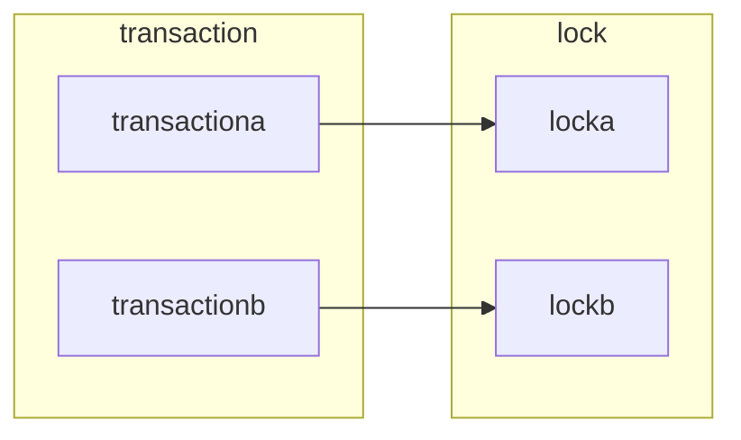

# 锁的算法

- `Record Lock`：行锁，锁住单条记录
- `Gap Lock`：索引锁，锁住一定范围索引
- `Next-key Lock`：初始为`Gap Lock`，如果索引唯一则降级为`Record Lock`

> `Gap Lock`是为了避免数据插入到一定范围的索引里面，但同时回产生幻读问题。
>
> 在`Next-key Lock`中，如果是唯一索引就回降级到`Record Lock`。
>
> 但如果是组合索引，还会对子索引加上`Gap Lock`，这样就导致了数据幻读。
>
> 因为不存在但是乱加锁，被认为了存在。

# 丢失更新

这个问题，同`java`的锁的`ABA`问题，假设`name`字段的数值这样变化


那么，第一个和第二个之间有区别么？曾经的修改有意义么？

对于数据库的修改

- 初始化$1000$
- 开启事务，扣除$999$，另一个账号$+999$
- 关闭事务

事务的提交丢失更新，也就是操作成功未成功记录的话，账户就还是$1000$。

但是另一个账户资产突然多了啊，对账就有问题。

同时，并发情况下还有一个问题：存款为负。

我们的确知道应该先查询，后修改

```mysql
select money from account where name="godme";
```

> ```mysql
> update set money=money-decrease where name="godme" and money > decrease and decrease > 0; 
> ```
>
> 直接更新不说，这个没问题，而且场景少。

但是问题在于，你准备修改的时候我能修改么。

上述的问题在于

- 首先会进行查询，最后回进行修改
- 查询和修改之间存在一定时延
- 查询时候不加写锁

所以两个事务先后读取到同一个数据，如果由于计算问题

最后是$money=\$num$而不是$money=money \pm \$num$，这种数据怎么去回溯。

```mysql
select money from account for update;
```

加上写锁，会更安全一些，也会降低出问题的可能性，避免更新丢失造成更大问题。

# 锁超时

## 超时时间

```mysql
show variables like 'innodb_lock_wait_time';
```


## 超时回滚

```mysql
show variables like 'innodb_rollback_on_timeout';
```


# 死锁检测

概念就不过多阐述，只是相互之间依赖对方放弃/索取，二造成的尴尬境地。

这里主要记录检测/解决死锁的办法

## <a href="#超时回滚">超时回滚</a>

如上所属，不重复叙述。

## `wait for graph`



同时在事务或者锁的链表中，都是相互指向的，如果形成闭环，就说明相互依赖，造成了死锁。

# 锁升级

## SQL Server

对于`Oracle` 而言，锁是非常耗费资源的，所以总是倾向于减少锁的数量，用粗粒度的锁来替代细粒度的锁。

也就是行锁变表锁或者更大的锁，这种方式称为锁升级。

- 数量超阈值：如果锁的数量超过指定数量，默认$5000$，自动发生锁升级。
- 内存超阈值：如果锁资源内存消耗超过激活内存$40\%$，自动发生锁升级

## MySQL

由于采用了`bitmap`进行管理，消耗不大，不涉及锁升级


