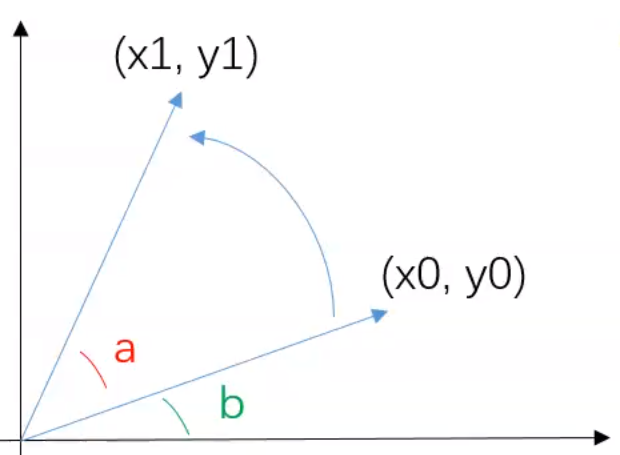

# 变换

对于一个平面图而言，它是多个像素点的组合而成的。

除去颜色，只剩下一张灰度图像；就连黑白都去掉，它就只是一堆点集的二维数组。

> 图片只是一个带有颜色和坐标的点集。

图像变换，就是在不改变集合中点的颜色信息的同时，去对各点的坐标进行变换。

其中单个点的变换

# 平移

对于平移而言，只是在基础数值上面进行加减运算

使用矩阵的方式进行表示

填充额外常数项，使用齐次方程进行表示

> 一般来说，我们都可以使用这种形式进行点位置变换的表达：即乘上一个变换矩阵。

平移参数中，可变参数有两个，为两个自由度。

# 伸缩

关于伸缩的话，有两种伸缩办法

- 线性
- 非线性

当$k_x =k_y$时候，就是线性伸缩，此时的伸缩是等比例的。直线伸缩之后斜率不变。

非线性变换的时候，就不能保证平行了。

加上平移，齐次表示一下

加上平移，自由度为4，如果是线性变换，自由度为3，因为$k_x = k_y$

# 旋转

旋转的话需要从线性上面才能更直观的体现。

虽然有六个参数，但是其中四个都分别依赖$a和b$,总自由度为4.

# 仿射

仿射变换和旋转的区别可以类比于缩放中的线性和非线性，这里会出现比较大的变化。

其中的每个参数之间关联不大，自由度由原来的4提升为6，在这里会丧失原图的更多性质。

相较而言，之前的变换有如下性质

- 保角性：角度不变
- 保线性：直线不弯
- 保比例：比例不变

仿射变换之后，只遗留了保线性。

# 投影

投影变换相较于之前的变换，使用的是三阶的变换矩阵。

变换的效果不再局限于$2D$，$3D$变换带有空间的透视感。但是丢失了最后的保线性。

从变换矩阵上看，总共有九个自由度，但是变换矩阵$A$需要满足如下条件

所以投影变换的自由度为8，需要四个点才能进行确定。

# 补充

## 自由度

其中所说的自由度可以简单的理解为变换矩阵中的未知数个数。

因为改变其中一个，变换都会发生改变，自由度也就是改变变换方式的维度。

## 求解

需要确定的点的个数，主要取决于求解变换矩阵未知数的点的个数。